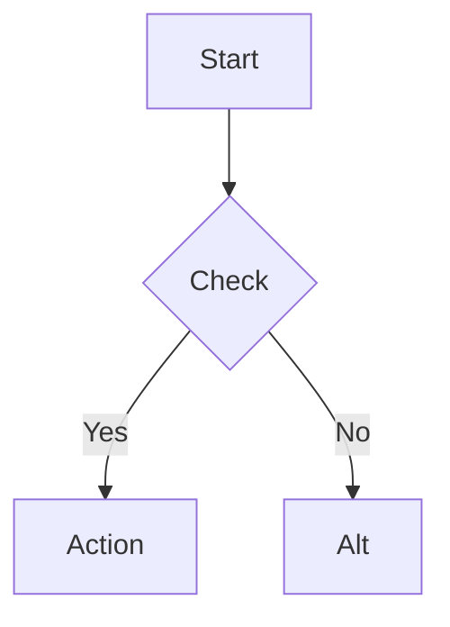

# Frontend Development Skill

## Overview

This skill ensures Claude Code builds UI components and features using the approved frontend stack. It enforces library choices, component patterns, responsive design, accessibility, and theme support.

**Core principle:** Stick to the approved stack, follow established patterns, design first when appropriate, verify quality.

**Announce at start:** "I'm using the frontend skill to ensure I follow your established UI stack and patterns."

## When to Use

Use this skill when:
- User requests UI component implementation (buttons, forms, cards, modals)
- User asks to build pages, screens, or dashboards
- User mentions "frontend," "UI," "interface," or "design"
- User requests animations or visual effects
- User asks about responsive design or theming

## When NOT to Use

Skip this skill for:
- Backend/API work (no UI component)
- CLI tool development
- Database schema changes
- Pure logic/services with no visual output

## The Workflow

### 1. Detect UI Work

Determine if the task involves building visual/interactive components. If yes, proceed.

### 2. Assess Complexity

Ask: "Should I design this first, or implement directly?"

**Design-first triggers:**
- New dashboards or multi-screen features
- Complex layouts with charts and visualization
- Multi-step user flows
- User explicitly requests design-first

**Direct implementation:**
- Single component updates
- Styling changes
- Following established patterns
- Bug fixes

### 3a. Design Phase (when triggered)

**Step 1: Gather requirements**
Ask one question at a time:
- What is the primary user action?
- What data must be displayed?
- Any layout constraints?

**Step 2: Create mockup**

ASCII art for layout:
```
┌──────────────────────┐
│  Header              │
├──────────────────────┤
│ ┌────┐  ┌────┐      │
│ │Card│  │Card│      │
│ └────┘  └────┘      │
└──────────────────────┘
```

Mermaid for flows:


**Step 3: Present options**

Use AskUserQuestion to show 2-3 design alternatives with trade-offs.

**Step 4: Validate**

Ask: "Does this approach address your needs? Any adjustments?"

**Step 5: Implement**

Follow implementation standards below.

### 3b. Implementation Phase

**Stack verification:**
- Confirm using approved libraries
- Check component organization
- Verify pattern usage

**Create TodoWrite checklist:**
```
☐ Verify stack (Shadcn, Tailwind, Lucide)
☐ Check component organization
☐ Implement with CVA for variants
☐ Add basic accessibility
☐ Ensure responsive (mobile-first)
☐ Add animations if appropriate
☐ Test theme support
```

### 4. Quality Check

Verify:
- Responsive (375px, 768px, 1440px)
- Accessible (keyboard nav, focus, labels)
- Themed (light and dark modes)
- Performant ('use client' only when needed)

## Approved Stack

**CRITICAL: Use ONLY these libraries. No substitutions without user permission.**

```yaml
Framework: Next.js 15.5.4 + React 19.2.0
Components: Shadcn UI 0.9.5 + Radix UI primitives
Styling: Tailwind CSS 3.4.18 + Class Variance Authority 0.7.1
Icons: Lucide React 0.545.0
Forms: React Hook Form 7.65.0 + Zod 3.25.76
State: Zustand 5.0.8 (app), React Query 5.90.5 (server)
Charts: Recharts 2.15.4
Animations: React Spring, Auto-animate
```

### Animation Decision Matrix

| Use Case | Library | Example |
|----------|---------|---------|
| Simple fade, slide | Auto-animate | List items, modals |
| Physics motion | React Spring | Draggable elements, counters |
| Complex sequences | React Spring + useChain | Multi-step animations |
| Layout shifts | CSS + Auto-animate | Grid changes, reordering |

**DO NOT use Framer Motion** (React 19 incompatibility)

### Component Organization

```
src/
├── components/
│   ├── ui/          # Shadcn (Button, Card, Dialog)
│   ├── features/    # Feature-specific (ActivityCard)
│   └── layouts/     # Page layouts (DashboardLayout)
├── lib/
│   ├── utils.ts     # cn() utility
│   ├── theme.ts     # Color system
│   └── api-client.ts
└── app/             # Next.js App Router
```

## Required Patterns

### 1. Component Composition

Use Shadcn composable pattern:

```tsx
// DO
<Card>
  <CardHeader>
    <CardTitle>Title</CardTitle>
  </CardHeader>
  <CardContent>Content</CardContent>
</Card>

// DON'T
<Card title="Title" content="Content" />
```

### 2. Variants with CVA

```tsx
// DO
const buttonVariants = cva("base", {
  variants: {
    variant: { default: "...", destructive: "..." }
  }
})

// DON'T
className={`btn ${destructive ? 'red' : 'blue'}`}
```

### 3. Theme Colors

```tsx
// DO
className="bg-primary text-primary-foreground"

// DON'T
className="bg-blue-500 text-white"
```

### 4. Mobile-First

```tsx
// DO
className="flex-col md:flex-row gap-4 md:gap-6"

// Touch targets minimum 48px
className="h-12 px-4"
```

## Quality Standards

### Accessibility (Basic)

```
☐ Keyboard navigation (Tab, Enter, Escape)
☐ Visible focus states
☐ aria-label on icon-only buttons
☐ Labels on form inputs
☐ Color contrast (Tailwind defaults)
☐ Respects prefers-reduced-motion
```

**WCAG 2.1 AA** (when requested):
- Contrast: 4.5:1 text, 3:1 large text
- Touch: 44x44px minimum
- Heading hierarchy (no skips)
- Alt text on images
- aria-describedby on errors

### Responsive Design

```
☐ Mobile-first breakpoints
☐ 48px touch targets on mobile
☐ Readable at 320px width
☐ Tested: 375px, 768px, 1440px
☐ Responsive images (w-full, max-w-*)
☐ No fixed widths breaking small screens
```

### Theme Support

```
☐ CSS variables from theme.ts
☐ Works in light and dark modes
☐ No hardcoded hex/rgb values
☐ Icons use currentColor
```

### Performance

```
☐ 'use client' only when needed
☐ Virtualization for long lists (react-window)
☐ Next.js Image component
☐ GPU animations (transform/opacity)
```

## Common Patterns

### Add Shadcn Component

```bash
npx shadcn@latest add button
npx shadcn@latest add dialog
```

Location: `/src/components/ui/[component-name].tsx`

### Feature Component

```tsx
'use client'

import { Card, CardHeader, CardTitle, CardContent } from '@/components/ui/card'
import { Button } from '@/components/ui/button'
import { Play, Pause } from 'lucide-react'
import { cn } from '@/lib/utils'

interface ActivityCardProps {
  title: string
  duration: number
  isActive?: boolean
  onToggle?: () => void
  className?: string
}

export function ActivityCard({
  title,
  duration,
  isActive = false,
  onToggle,
  className
}: ActivityCardProps) {
  return (
    <Card className={cn("hover:shadow-lg transition-shadow", className)}>
      <CardHeader>
        <CardTitle className="flex items-center justify-between">
          {title}
          <Button
            variant="ghost"
            size="icon"
            onClick={onToggle}
            aria-label={isActive ? "Pause" : "Start"}
          >
            {isActive ? <Pause className="h-4 w-4" /> : <Play className="h-4 w-4" />}
          </Button>
        </CardTitle>
      </CardHeader>
      <CardContent>
        <p className="text-sm text-muted-foreground">{duration} min</p>
      </CardContent>
    </Card>
  )
}
```

### Form with Validation

```tsx
'use client'

import { useForm } from 'react-hook-form'
import { zodResolver } from '@hookform/resolvers/zod'
import * as z from 'zod'
import { Button } from '@/components/ui/button'
import { Input } from '@/components/ui/input'
import { Label } from '@/components/ui/label'

const schema = z.object({
  email: z.string().email('Invalid email'),
  password: z.string().min(8, 'Min 8 characters')
})

type FormData = z.infer<typeof schema>

export function LoginForm() {
  const { register, handleSubmit, formState: { errors } } = useForm<FormData>({
    resolver: zodResolver(schema)
  })

  return (
    <form onSubmit={handleSubmit((data) => console.log(data))} className="space-y-4">
      <div>
        <Label htmlFor="email">Email</Label>
        <Input
          id="email"
          {...register('email')}
          aria-invalid={!!errors.email}
        />
        {errors.email && (
          <p className="text-sm text-destructive mt-1">{errors.email.message}</p>
        )}
      </div>
      <Button type="submit" className="w-full">Sign In</Button>
    </form>
  )
}
```

### Auto-animate

```tsx
'use client'

import { useRef, useEffect } from 'react'
import autoAnimate from '@formkit/auto-animate'

export function AnimatedList({ items }: { items: string[] }) {
  const parent = useRef(null)

  useEffect(() => {
    parent.current && autoAnimate(parent.current)
  }, [parent])

  return (
    <ul ref={parent} className="space-y-2">
      {items.map((item, i) => (
        <li key={i} className="p-4 bg-card rounded-lg">{item}</li>
      ))}
    </ul>
  )
}
```

### React Spring

```tsx
'use client'

import { useSpring, animated } from '@react-spring/web'

export function FadeInCard({ children }: { children: React.ReactNode }) {
  const springs = useSpring({
    from: { opacity: 0, transform: 'translateY(20px)' },
    to: { opacity: 1, transform: 'translateY(0px)' },
    config: { tension: 280, friction: 60 }
  })

  return <animated.div style={springs}>{children}</animated.div>
}
```

### Responsive Layout

```tsx
export function DashboardLayout({ children }: { children: React.ReactNode }) {
  return (
    <div className="container mx-auto p-4 md:p-6 lg:p-8">
      <div className="grid grid-cols-1 md:grid-cols-2 lg:grid-cols-3 gap-4 md:gap-6">
        {children}
      </div>
    </div>
  )
}
```

## Common Mistakes

**1. Using Framer Motion** - incompatible with React 19, use React Spring
**2. Hardcoded colors** - use CSS variables from theme.ts
**3. Desktop-first breakpoints** - use mobile-first (base → sm → md → lg)
**4. Missing accessibility** - keyboard nav, focus states, ARIA labels
**5. Skipping 'use client'** - needed for hooks, event handlers, browser APIs
**6. Conditional className** - use CVA for variants
**7. Tight coupling** - components in /ui should be reusable

## Additional Resources

See design document: `docs/plans/2025-10-27-frontend-skill-design.md`

## Best Practices

- Design first for complex UIs
- Use TodoWrite for quality checklists
- Test responsive at 375px, 768px, 1440px
- Verify theme support (light/dark)
- Add animations only when they enhance UX
- Keep components composable
- Use cn() for className merging
- Follow mobile-first approach

## Quick Reference

| Task | Action |
|------|--------|
| Add component | `npx shadcn@latest add [name]` |
| Style variant | Use CVA |
| Animation simple | Auto-animate |
| Animation physics | React Spring |
| Form validation | React Hook Form + Zod |
| Icons | Lucide React |
| Responsive | Mobile-first Tailwind |
| Colors | CSS variables |
| State (app) | Zustand |
| State (server) | React Query |
